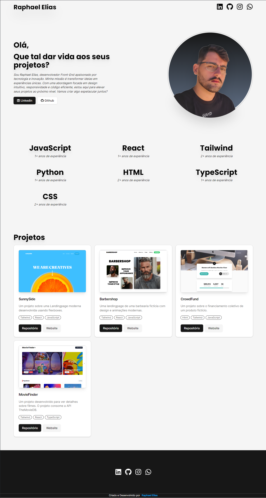
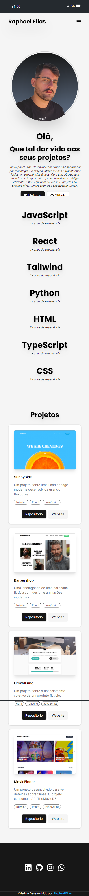

# Meu Portfólio Pessoal

Bem-vindo ao repositório do meu portfólio pessoal! Este projeto foi desenvolvido para demonstrar minhas habilidades em desenvolvimento web, utilizando as tecnologias React, Tailwind, TypeScript e Firebase.

## 🚀 Funcionalidades Principais

- **Consumo de dados do Firebase**: Utiliza o Firebase para armazenamento e recuperação de dados.
- **Responsividade**: Design totalmente responsivo, garantindo uma ótima experiência em dispositivos móveis, tablets e desktops.

## 🛠️ Tecnologias Utilizadas

- **React**: Biblioteca JavaScript para construção de interfaces de usuário.
- **Tailwind CSS**: Framework CSS utilitário para estilização rápida e eficiente.
- **TypeScript**: Superset do JavaScript que adiciona tipagem estática ao código.
- **Firebase**: Plataforma de desenvolvimento de aplicativos móveis e web da Google.

## 📸 Screenshots





## 💼 Objetivo

Este portfólio foi criado com o objetivo de mostrar minhas habilidades e dedicação em desenvolvimento web. Estou em busca de oportunidades para estágio ou uma posição de front-end júnior.

## 🔗 Links

- **Portfólio Online**: [raphaelelias.tech](https://raphaelelias.tech)
- **Repositório no GitHub**: [GitHub](https://github.com/raphaeleliass/portfolio)

## ⚙️ Como Executar o Projeto

1. Clone o repositório:
    ```sh
    git clone https://github.com/raphaeleliass/portfolio
    ```
2. Navegue até o diretório do projeto:
    ```sh
    cd portfolio
    ```
3. Instale as dependências:
    ```sh
    npm install
    ```
4. Inicie o servidor de desenvolvimento:
    ```sh
    npm run dev
    ```

## 🤝 Contribuição

Contribuições são sempre bem-vindas! Se você tiver sugestões ou melhorias, por favor, abra uma issue ou envie um pull request.

## 📧 Contato

Se você quiser discutir sobre o projeto ou oportunidades de trabalho, sinta-se à vontade para me contatar:
- **LinkedIn**: [Meu Linkedin](https://linkedin.com/in/seuperfil/)
- **Instagram**: [Meu Instagram](https://instagram.com/raphaeleliass)
